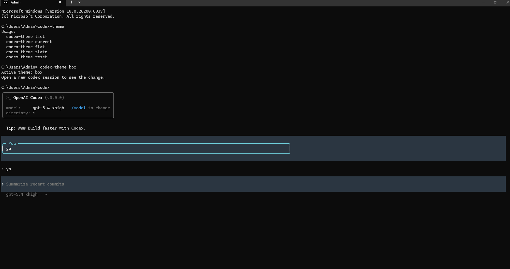
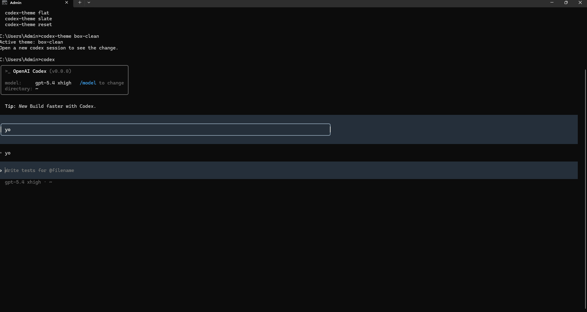
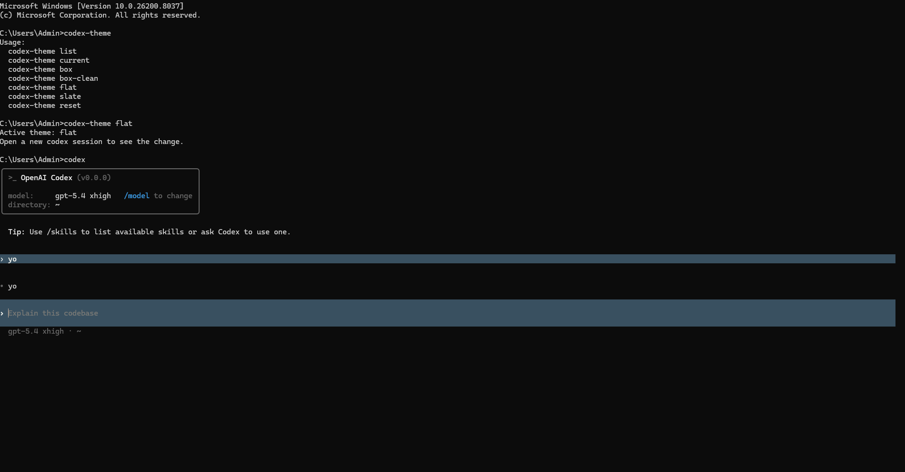
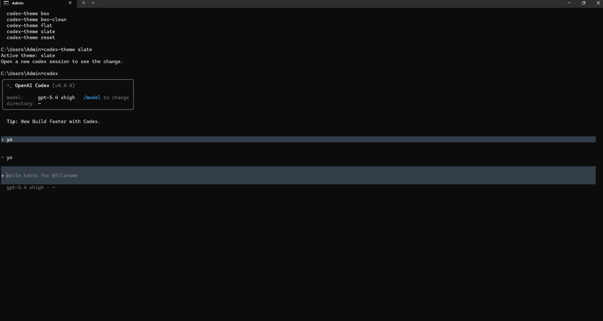

# Codex Chat Themes for Windows

Theme switcher for the open-source Codex CLI on Windows x64.

This repo adds a few user-message layouts to the Codex TUI and installs a small `codex-theme` command so you can switch between them from `cmd.exe` or PowerShell.

## Theme Previews

These are real screenshots from the Windows build in this repo.

### `box`



### `box-clean`



### `flat`



### `slate`



Supported themes:

- `box`: framed user prompt with the `You` label
- `box-clean`: framed user prompt without the label
- `flat`: flat highlighted prompt bar
- `slate`: muted flat prompt bar

Tested against upstream Codex commit:

- `1de0085418340b3e7f7136cfb5e56b4bebafc584`

## Download

If you do not want to clone or build anything, download the latest Windows zip from GitHub Releases, extract it, then run:

```cmd
install.cmd
```

That release bundle already includes:

- `codex.exe`
- `install.cmd`
- `install.ps1`
- `rollback.cmd`
- `rollback.ps1`
- `codex-theme.cmd`

You still need `codex` installed via npm on the target machine.

## What this repo contains

- `patches/codex-chat-themes.patch`: patch against the upstream `openai/codex` repo
- `windows/build.ps1`: applies the patch and builds `codex.exe`
- `windows/build-and-install.ps1`: one-command clone/build/install script
- `windows/build-and-install.cmd`: double-click friendly Windows wrapper
- `windows/install.ps1`: installs the built binary into your existing npm Codex launcher
- `windows/install.cmd`: double-click friendly installer wrapper
- `windows/rollback.ps1`: restores the original launcher
- `windows/rollback.cmd`: double-click friendly rollback wrapper
- `windows/package-release.ps1`: assembles a GitHub Releases zip bundle
- `.github/workflows/release.yml`: builds and publishes the Windows release bundle on tags
- `windows/codex-theme.cmd`: theme-switch command

## Requirements

For source builds:

- Windows x64
- Rust toolchain with `cargo`
- Visual Studio 2022 C++ build tools or Visual Studio Community with MSVC
- `codex` already installed via npm
- `git`

## One-Click Setup From Source

If you already have the prerequisites above, you can do the full setup with one command:

```cmd
windows\build-and-install.cmd
```

That wrapper will:

- clone `openai/codex` into `..\codex-src` if it is missing
- apply the patch
- build a release `codex.exe`
- install the custom launcher

If your Codex source lives somewhere else:

```powershell
powershell -ExecutionPolicy Bypass -File .\windows\build-and-install.ps1 -CodexSourcePath C:\path\to\codex-src
```

## Manual Build

Clone the upstream Codex repo first:

```powershell
git clone https://github.com/openai/codex.git codex-src
```

Build the themed binary:

```powershell
powershell -ExecutionPolicy Bypass -File .\windows\build.ps1 -CodexSourcePath C:\path\to\codex-src -Configuration Release
```

By default it builds to:

```text
D:\codex-build-themes\release\codex.exe
```

## Install

If you already built the binary yourself:

```powershell
powershell -ExecutionPolicy Bypass -File .\windows\install.ps1 -BuiltCodexExePath D:\codex-build-themes\release\codex.exe
```

If you downloaded a release bundle, just run:

```cmd
install.cmd
```

That script:

- backs up `%APPDATA%\npm\codex.cmd` to `codex.cmd.orig`
- installs `codex-theme.cmd`
- creates `%USERPROFILE%\.codex\chat-theme.txt` if needed
- rewrites `codex.cmd` so it launches the custom binary first and falls back to the original launcher

## Usage

Open a new shell after installation.

```cmd
codex-theme list
codex-theme current
codex-theme box
codex-theme box-clean
codex-theme flat
codex-theme slate
codex-theme reset
```

Then start a new Codex session:

```cmd
codex
```

## Rollback

For a release bundle:

```cmd
rollback.cmd
```

Or directly:

```powershell
powershell -ExecutionPolicy Bypass -File .\windows\rollback.ps1
```

This restores the original `codex.cmd` and removes `codex-theme.cmd`.

## Notes

- The repo can publish prebuilt Windows bundles through GitHub Releases.
- The install path assumes the npm launcher is at `%APPDATA%\npm\codex.cmd`.
- The patch only changes the user-message presentation inside the Codex TUI. It does not require WezTerm.
